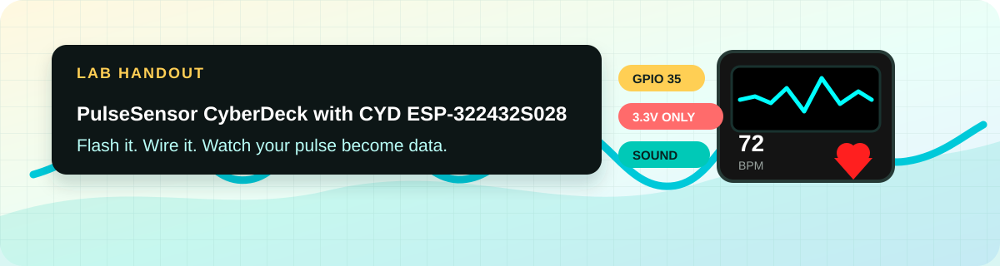
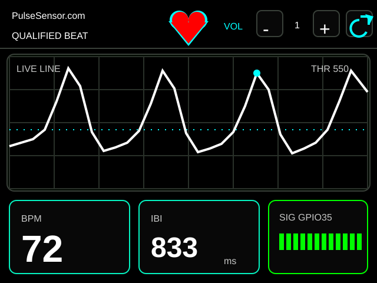
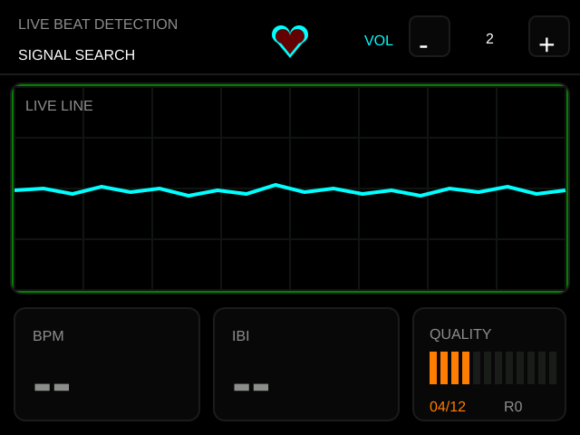

# PulseSensor CYD Dashboard

A one-screen PulseSensor heartbeat dashboard for the ESP32 **Cheap Yellow Display** (CYD). Flash from your browser, wire three colored wires, and watch your pulse live with sound, light, and touch volume.



> **Educational biofeedback demo &mdash; not for medical use.**

---

## 👉 Easiest install: [pulsesensor.com/pages/cyd](https://pulsesensor.com/pages/cyd)

That page has a one-click web installer, wiring diagram, and the full tutorial. Use it if you just want to flash your CYD and see your heartbeat. This README is for people who want to read the source or build from source.

---

## What You Get

| Channel | Feedback |
| --- | --- |
| Screen | Cyan waveform (searching) → white waveform (locked), dotted `THR 550` guide, BPM, IBI, compact `SIG GPIO35` quality bars that move yellow → green |
| Light | Rear LED pulses yellow while locking and red once locked, using the same smooth heartbeat fade |
| Sound | Rising signal-quality harmony while locking, then short heartbeat tone on the CYD speaker (GPIO 26) |
| Touch | Header buttons change speaker volume, default 1/10, and rotate the dashboard for different enclosures |
| Heart | Centered animated red heart with cyan outline |

Current horizontal dashboard:



| Searching for signal | Locked on qualified beat |
| --- | --- |
|  |  |

---

## Wire The PulseSensor

| PulseSensor Wire | CYD Connection |
| --- | --- |
| Red (+V) | `3.3V` on CN1 |
| Black (GND) | `GND` on P3 or CN1 |
| Purple (Signal) | `GPIO 35` on P3 |

**Use 3.3V, not 5V.** Signal must go to `GPIO 35`.

---

## Flash Your CYD

### Option A — One-click web installer (recommended)

Go to **[pulsesensor.com/pages/cyd](https://pulsesensor.com/pages/cyd)** in Chrome, Edge, or Brave on a desktop or laptop. Plug in your CYD over USB. Click **Install**.

The same installer is also hosted from this repo:
**[worldfamouselectronics.github.io/PulseSensor_CYD/](https://worldfamouselectronics.github.io/PulseSensor_CYD/)**

### Option B — Local USB flash with PlatformIO

This branch includes a `platformio.ini` for repeatable local builds and uploads.

1. Plug one CYD into USB.
2. Detect the serial port:

```bash
pio device list
```

3. Build and flash:

```bash
pio run -e cyd
pio run -e cyd -t upload
```

The current developer config uses `/dev/cu.usbserial-210` as `upload_port`. If your CYD appears on a different port, update `platformio.ini` before uploading. The config includes the required `TFT_eSPI` CYD display compile flags and uses `115200` upload speed.

### Option C — Build in Arduino IDE

The firmware is intentionally kept as one `.ino` file so beginners can open it directly:

```text
PulseSensor_CYD.ino
```

Steps:

1. Download `PulseSensor_CYD.ino`.
2. Make a folder named `PulseSensor_CYD`. Put the `.ino` file inside.
3. Open it in Arduino IDE 2.x.
4. Install the ESP32 board package.
5. Install these libraries: `TFT_eSPI`, `PulseSensor Playground`, `XPT2046_Touchscreen`.
6. Configure `TFT_eSPI` for the CYD display (see `platformio.ini` for the exact build flags &mdash; preferred over editing global `User_Setup.h`).
7. Select an ESP32 board and upload at `115200`.

---

## PulseSensor Playground Tie-Ins

Every reading on screen comes directly from the [PulseSensor Playground](https://github.com/WorldFamousElectronics/PulseSensorPlayground) library, so what you see is what you'd see in your own Arduino sketches.

| On screen | Playground call |
| --- | --- |
| Live waveform | `getLatestSample()` |
| Heart pulse / LED blink / tone | `sawStartOfBeat()` |
| Inside-beat indicator | `isInsideBeat()` |
| BPM | `getBeatsPerMinute()` |
| IBI | `getInterBeatIntervalMs()` |
| Amplitude meter | `getPulseAmplitude()` |
| Dotted threshold guide | `setThreshold(550)` |

The 12-step quality meter is shown as bars in the compact `SIG GPIO35` panel. Lock requires four consecutive qualified beats, a healthy live signal range, and low recent clipping, which keeps the classroom demo from locking onto obvious false positives.

The `SIG GPIO35` label is intentionally compact because a future revision may show two PulseSensor inputs side by side.

### Feedback Color Language

The dashboard uses a small, consistent color vocabulary so beginners can learn the state at a glance:

- **Cyan:** live waveform and graph guide details.
- **Yellow:** signal is promising and the detector is locking. The `SIG GPIO35` bars and rear LED both use yellow here.
- **Green:** signal is locked. The `SIG GPIO35` box and bars turn green.
- **Red:** confirmed heartbeat feedback. The rear LED and on-screen heart use red after lock.

The rear LED is intentionally expressive rather than diagnostic. It should feel alive: yellow says "finding your beat," red says "got it." More detailed explanations belong in the docs, not on the tiny CYD screen.

---

## Quick Troubleshooting

**No serial port?** Try a different USB cable &mdash; many micro-USB cables are charge-only.

**Flat waveform?** Confirm the purple wire is on `GPIO 35`, not 36 or 34.

**Erratic readings?** Gentle, steady finger pressure. Insulate the back of the sensor. The [Stabilizer Ring](https://pulsesensor.com/products/gold-stablizer-ring) gives the cleanest signal.

**BPM stays at 0?** Give it 5&ndash;10 seconds. The detector needs a few clean beats before it reports BPM.

---

## Hardware Reference

- **Board:** ESP32-2432S028 CYD
- **Display:** ILI9341 320&times;240 TFT
- **Sensor input:** PulseSensor signal on `GPIO 35`
- **RGB LED:** onboard CYD LED, active-low PWM
- **Speaker:** `GPIO 26`
- **Touch:** XPT2046 controller on HSPI

```text
PULSE_PIN       = 35
BACKLIGHT       = 21
LED_RED_PIN     = 4
LED_GREEN_PIN   = 16
LED_BLUE_PIN    = 17
SPEAKER_PIN     = 26
TOUCH_IRQ       = 36
TOUCH_MISO      = 39
TOUCH_MOSI      = 32
TOUCH_SCLK      = 25
TOUCH_CS        = 33
```

### Why GPIO 35?

The PulseSensor signal pin on this CYD revision was found with a small analog pin scanner. Signal was visible on `IO35`, not the originally documented `GPIO 36`. The scanner is its own diagnostic sketch: [CYD_Analog_Pin_Scanner](https://github.com/yury-g/CYD_Analog_Pin_Scanner).

### ESP32 analog quirk

PulseSensorPlayground's detector expects 10-bit analog samples (`0..1023`, idle near `512`). ESP32 defaults to 12-bit (`0..4095`), so this firmware calls:

```cpp
analogReadResolution(10);
```

That keeps the library's threshold and beat-detection math in the range it expects.

---

## Feature Wishlist

Useful next ideas, only if they improve the student experience or the accuracy of the reading:

- **Method Overlay:** tap the quality panel to cycle through the live Playground method names behind each reading.
- **USB Serial Lab Mode:** optional Playground-style serial output for Arduino Serial Plotter or a WebSerial monitor.

## Nice-To-Have UI Polish

These are good follow-ups, but should stay secondary to the one-screen dashboard:

- **Beat-dot legend:** add a tiny `DOT = BEAT` or equivalent label near the graph if it fits without clutter.
- **Brand consistency:** keep `PulseSensor.com` large and readable in the first view, and make sure screenshots/docs always show the brand clearly.
- **First-run affordance:** consider a simple idle prompt such as `PLACE FINGER` if new users need more guidance than `SIGNAL SEARCH`.
- **Keep teaching copy off-device:** use the README, Shopify page, and screenshots for explanations; keep the CYD UI instrument-like and readable.

## Avoid For Now

Good Playground branches that should stay out of this default firmware until they clearly improve the CYD experience:

- Multi-sensor and Pulse Transit Time experiments &mdash; extra wiring; wait until the one-sensor lesson is rock solid.
- WiFi server mode &mdash; credentials and classroom setup friction without improving the default experience.
- Servo or motor outputs &mdash; fun, but they add hardware without improving accuracy here.
- Automatic Playground `blinkOnPulse()` / `fadeOnPulse()` &mdash; less clear than the current qualified-beat-gated CYD LED feedback.

---

## Web Installer Firmware

The web installer's binary parts live in `firmware/`, and the root `manifest.json` lists their ESP Web Tools offsets:

- `firmware/bootloader.bin` (offset `0x1000`)
- `firmware/partitions.bin` (offset `0x8000`)
- `firmware/boot_app0.bin` (offset `0xE000`)
- `firmware/firmware.bin` (offset `0x10000`)

Use the PlatformIO local flash path above while iterating on source. Regenerate and replace the installer binaries before publishing a web-flasher release.

## Regenerate Screenshots

The checked-in screenshots are SVG recreations of the CYD screen in `docs/screenshots/`. Update them whenever the on-device layout changes.

Older screenshot sets are kept under `docs/screenshots/history/` as design-version history.

## Development Checkpoints

The current hardware-tested branch is:

```text
codex/finger-coach-dashboard-20260519-111641-EDT
```

Timestamped local tags record the iteration path:

- `last-working-20260519-114323-EDT` — one-screen dashboard with threshold label before false-positive tuning.
- `false-positive-tune-20260519-114323-EDT` — re-applied stricter signal lock: four consecutive qualified beats, healthy live range, and low recent clipping.
- `signal-box-minimal-20260519-114712-EDT` — compact `SIG GPIO35` quality-bar panel.
- `rotate-control-20260522-121644-EDT` — hardware-tested top-row screen rotation control.

See `docs/experiment-log.md` for the rejected Signal Dashboard / Finger Coach side quest. The only UI idea carried forward from that experiment is the dotted threshold line plus `THR 550` label.

---

## Release

Current release: `v1.2.0`. First known-good single-screen release: `v1.0.0`. See [CHANGELOG.md](CHANGELOG.md).

---

## License & Credits

MIT. Made by [World Famous Electronics](https://pulsesensor.com/pages/about-us) &mdash; the original PulseSensor since 2012.

Heartbeats in your project, lickety-split. ♥
