# PulseSensor CYD Dashboard

A one-screen PulseSensor heartbeat dashboard for the ESP32 **Cheap Yellow Display** (CYD). Flash from your browser, wire three colored wires, and watch your pulse live with sound, light, and touch volume.


> **Educational biofeedback demo &mdash; not for medical use.**

---

## Public One-Click Install: [pulsesensor.com/pages/cyd](https://pulsesensor.com/pages/cyd)

That page has a one-click web installer, wiring diagram, and the full tutorial for the published public firmware. Use the source-flash instructions below when you want the current app-shell preview with the new screens, colors, Settings page, and `Origin Story` app.

---

## What You Get

| Channel | Feedback |
| --- | --- |
| Screen | Cyan waveform (searching) → white waveform (locked), dotted `THR 550` guide, BPM, IBI, compact `SIG GPIO35` quality bars that move yellow → green |
| Light | Rear LED pulses yellow while locking and red once locked, using the same smooth heartbeat fade |
| Sound | Rising signal-quality harmony while locking, then short heartbeat tone on the CYD speaker (GPIO 26) |
| Touch | Header buttons change speaker volume, default 1/10, and rotate the dashboard for different enclosures |
| Heart | Centered animated red heart with cyan outline |

Current horizontal dashboard:


| Searching for signal | Locked on qualified beat |
| --- | --- |
|  |  |

Portrait mode:

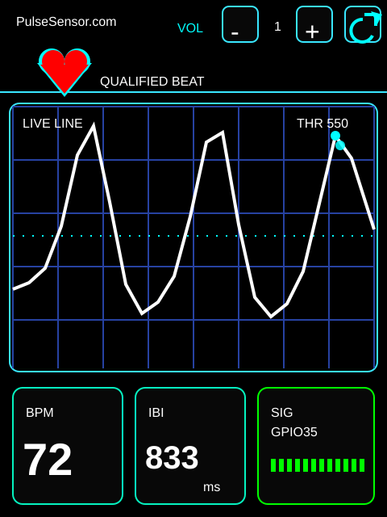

Beat-dot explainer:

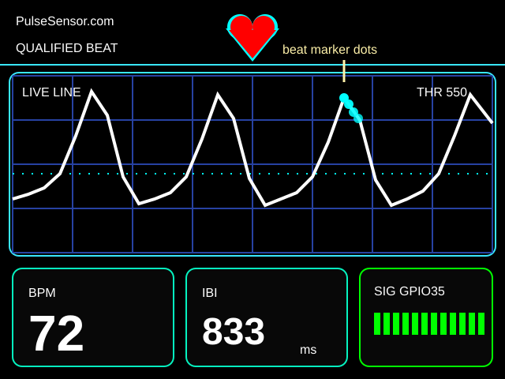

## Version History And Major Changes

Use this section as the quick human-readable project log. See [CHANGELOG.md](CHANGELOG.md) for the full detailed history.

### App 4 pin-scanner experiment — 2026-05-24

This branch adds the standalone CYD Analog Pin Scanner as App 4 inside the launcher:

```text
Branch: codex/app4-pin-scanner-20260524
Firmware: 0.4.10-manual-pin-scanner
Source scanner: yury-g/CYD_Analog_Pin_Scanner c203d85
```

- Added App 4 `Pin Scanner`, based on the standalone `CYD_Analog_Pin_Scanner` diagnostic sketch.
- Lists `GPIO 35`, `GPIO 22`, `GPIO 21`, and `GPIO 27`, starts with scanning inactive, and lets you tap one pin row at a time.
- Reads only ADC-capable test targets (`GPIO 35` and `GPIO 27`) and guards `GPIO 22` / `GPIO 21` with status text instead of calling `analogRead()` on them.
- Keeps the Pulse app on 10-bit ADC reads and switches to 12-bit only while App 4 is active on an ADC-capable row.
- Reordered the app flow so Settings is after Pulse, Pin Scanner is after Settings, `your app here` stays second-to-last, and `Origin Story` stays the final app screen.
- Added a Settings `Memory` row showing free heap on the current device.
- Added App 4 mockups for `M DARK`, `M LIGHT`, `C DARK`, and `C LIGHT`, plus a contact sheet under `docs/screenshots/app4-pin-scanner-render/`.

### App-shell preview — 2026-05-24

This is the current good development pause point for the app shell branch:

```text
Branch: codex/monochrome-ui-treatment-20260524
Head:   af2a5c2 Add screenshot contact sheet
```

- Added a compact app shell around the Pulse dashboard: App 1 is the live Pulse dashboard, App 2 is a placeholder, App 3 is `Origin Story`, and this App 4 branch adds `Pin Scanner`.
- Added Settings-only controls for Volume, Rotation, Display, WiFi/Bluetooth placeholders, LED Control, LED swatches, About, Version, and Firmware date.
- Added four display modes under Settings `Display`: `M DARK`, `M LIGHT`, `C DARK`, and `C LIGHT`.
- Added high-contrast Settings rows, larger touch targets, render-preview tools, and the current screenshot sets for the new colors and Settings screen.
- Added the `Origin Story` starfield crawl and programmatic fanfare. The current crawl words are placeholder copy for a later writing pass.

### v1.2.0 — 2026-05-15

- Added Signal Coach teaching feedback: `TOO FLAT`, `HOLD STEADY`, `GOOD WAVE`, `LOCKING`, and `QUALIFIED BEAT`.
- Added the amplitude meter and dotted `THR 550` guide.
- Lowered startup volume to `1/10`.

### v1.1.0 — 2026-05-14

- Added beat sound on the CYD speaker and touch volume controls.
- Added the centered animated heart and cyan/white waveform behavior.
- Added the first ESP Web Tools browser flasher prototype.
- Reworked the README into a flash-first, student-friendly guide.

### v1.0.0 — 2026-05-13

- Established the known-good one-screen CYD Pulse dashboard.
- Switched PulseSensor input to `GPIO 35` for the tested CYD hardware.
- Added BPM, IBI, waveform, signal quality bars, rear LED pulse, and automatic detector re-arm.

### v0.2.0 — 2026-04-08

- Built the first complete five-app launcher sketch.
- Added touch menu navigation and early Heartbeat, Breathing, Relaxation, HRV, and BreathFFT apps.
- Status at that point was still incomplete and not yet hardware-verified.

### v0.1.0 — 2026-04-08

- Started the repository with a placeholder README and initial Git history.

## Current App Shell Development Preview

This branch is the current App 4 experiment branch on `codex/app4-pin-scanner-20260524`. It builds on the app shell now merged to `main`, keeps the Pulse dashboard as App 1, keeps placeholder App 2 and the `Origin Story` App 3 crawl, adds `Pin Scanner` as App 4, and keeps settings in a dedicated scrollable Settings screen with larger finger-friendly controls.

Use these images to review the new screens, colors, and Settings treatment before flashing another CYD. The current `Origin Story` content is intentionally placeholder text; keep the renderer and layout, then drop in revised crawl copy during a later text-edit pass.

### App 1: Pulse Dashboard Render

| Landscape searching | Landscape locked |
| --- | --- |
| 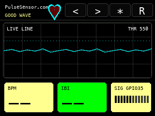 | 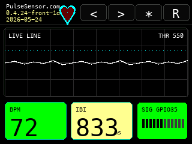 |

| Portrait searching | Portrait locked |
| --- | --- |
| 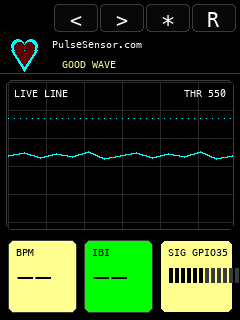 | 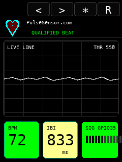 |

### Settings Screen Render

| Landscape top | Landscape middle | Landscape bottom |
| --- | --- | --- |
| 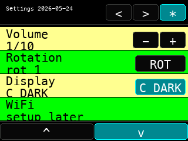 | 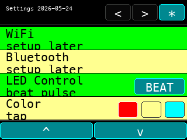 | 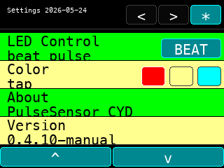 |

| Portrait top | Portrait middle | Portrait bottom |
| --- | --- | --- |
| 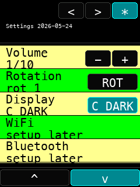 | 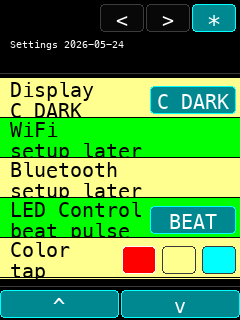 | 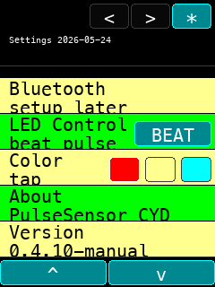 |

### App 3: Origin Story Render

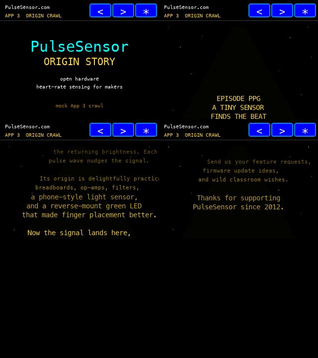

### App 4: Pin Scanner Render

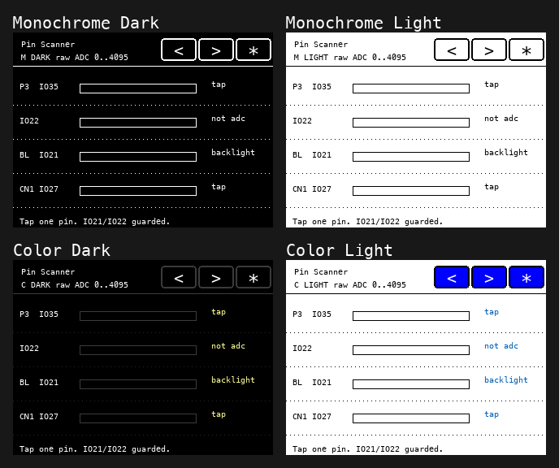

The render helpers are in `tools/render_pulse_app_mock.py`, `tools/render_settings_mock.py`, `tools/render_app3_origin_crawl_mock.py`, and `tools/render_app4_pin_scanner_mock.py`. They are intentionally lightweight PNG mockups used for quick UI iteration before flashing the CYD. Refresh the GitHub screenshot folder contact sheet with `python3 tools/update_screenshot_contact_sheet.py`.

### Internal Design Memory: 2026-05-24 Display Modes

This section is an internal firmware-development memory trail. It is intentionally image-heavy so future contributors can see the UI evolution visually before reading code. It does not need to be copied to the public customer tutorial.

The 2026-05-24 pass explored a maximum-readability display treatment for no-glasses use: larger controls, more black space, true black/white monochrome modes, high-contrast color modes, dotted outlines for inactive or no-data states, a compact three-button app nav bar, Settings-only rotation, and a fatter centered heart in the freed header space.

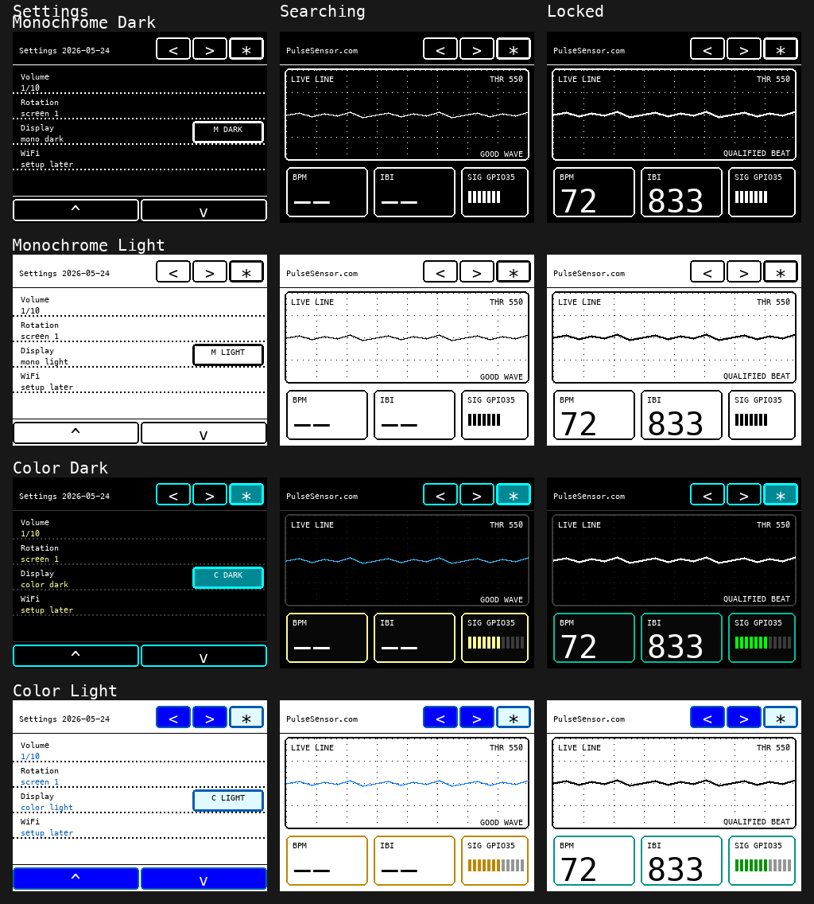

#### Settings Display Picker

| Monochrome Dark | Monochrome Light |
| --- | --- |
| 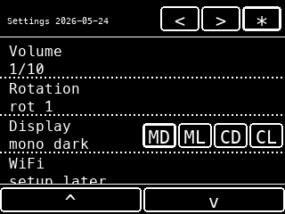 | 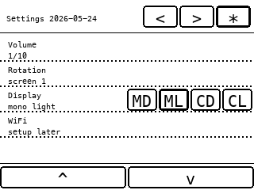 |

| Color Dark | Color Light |
| --- | --- |
| 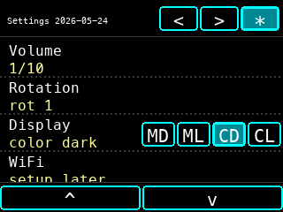 | 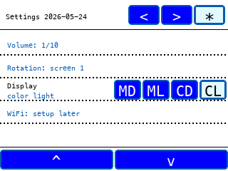 |

#### Pulse Dashboard Display Modes

| Mode | Searching | Locked |
| --- | --- | --- |
| Monochrome Dark |  | 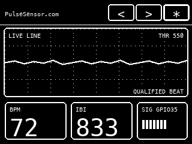 |
| Monochrome Light | 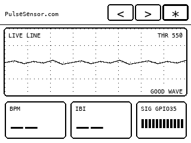 | 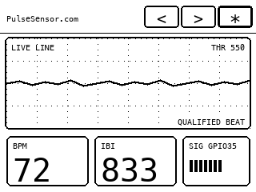 |
| Color Dark | 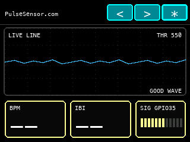 | 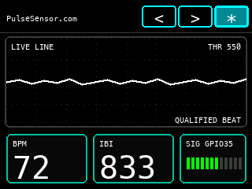 |
| Color Light | 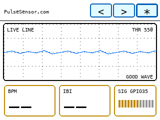 | 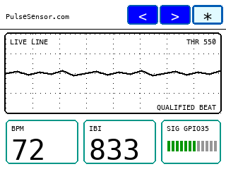 |

#### True Black/White Exploration

| Dark monochrome searching | Dark monochrome locked |
| --- | --- |
| 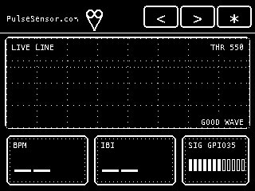 | 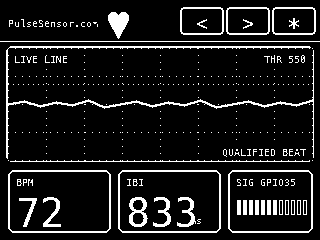 |

| Light inverse searching | Light inverse locked |
| --- | --- |
| 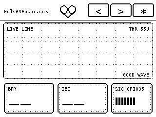 | 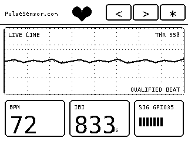 |

---

## Wire The PulseSensor

| PulseSensor Wire | CYD Connection |
| --- | --- |
| Red (+V) | `3.3V` on CN1 |
| Black (GND) | `GND` on P3 or CN1 |
| Purple (Signal) | `GPIO 35` on P3 |

**Use 3.3V, not 5V.** Signal must go to `GPIO 35`.

---

## Flash Your CYD

### Option A — Current App 4 preview from source

Use this path on any computer when you want the current app shell, display modes, new Settings screen, `Origin Story`, and App 4 `Pin Scanner` from this branch. This does not require a Codex session.

1. Install Git, Python 3, and PlatformIO:

```bash
python3 -m pip install --user platformio
```

2. Clone this repo and check out the current App 4 branch:

```bash
git clone https://github.com/yury-g/CYD_App_Launcher.git
cd CYD_App_Launcher
git checkout codex/app4-pin-scanner-20260524
git log -1 --oneline
```

Confirm `git log -1 --oneline` shows the latest App 4 pin-scanner commit before flashing.

3. Plug in one CYD and detect the serial port:

```bash
pio device list
```

On macOS the port usually looks like `/dev/cu.usbserial-3120`, `/dev/cu.usbserial-210`, or similar. On Windows it usually looks like `COM3`, `COM4`, or similar.

4. Build and flash, replacing the port with the one you detected:

```bash
pio run -e cyd
pio run -e cyd -t upload --upload-port /dev/cu.usbserial-3120
```

This branch includes a `platformio.ini` for repeatable local builds and uploads.

### Option B — Public one-click web installer

Go to **[pulsesensor.com/pages/cyd](https://pulsesensor.com/pages/cyd)** in Chrome, Edge, or Brave on a desktop or laptop. Plug in your CYD over USB. Click **Install**.

The same installer is also hosted from this repo:
**[worldfamouselectronics.github.io/PulseSensor_CYD/](https://worldfamouselectronics.github.io/PulseSensor_CYD/)**

Important: the public one-click installer is for the published tutorial firmware unless the checked-in `firmware/` binaries have been regenerated from this branch. To test the new screens, display modes, and App 4 pin scanner right now, use Option A.

### Option C — Build in Arduino IDE

The firmware is intentionally kept as one `.ino` file so beginners can open it directly:

```text
PulseSensor_CYD.ino
```

Steps:

1. Download `PulseSensor_CYD.ino`.
2. Make a folder named `PulseSensor_CYD`. Put the `.ino` file inside.
3. Open it in Arduino IDE 2.x.
4. Install the ESP32 board package.
5. Install these libraries: `TFT_eSPI`, `PulseSensor Playground`, `XPT2046_Touchscreen`.
6. Configure `TFT_eSPI` for the CYD display (see `platformio.ini` for the exact build flags &mdash; preferred over editing global `User_Setup.h`).
7. Select an ESP32 board and upload at `115200`.

---

## PulseSensor Playground Tie-Ins

Every reading on screen comes directly from the [PulseSensor Playground](https://github.com/WorldFamousElectronics/PulseSensorPlayground) library, so what you see is what you'd see in your own Arduino sketches.

| On screen | Playground call |
| --- | --- |
| Live waveform | `getLatestSample()` |
| Heart pulse / LED blink / tone | `sawStartOfBeat()` |
| Inside-beat indicator | `isInsideBeat()` |
| BPM | `getBeatsPerMinute()` |
| IBI | `getInterBeatIntervalMs()` |
| Amplitude meter | `getPulseAmplitude()` |
| Dotted threshold guide | `setThreshold(550)` |

The 12-step quality meter is shown as bars in the compact `SIG GPIO35` panel. Lock requires four consecutive qualified beats, a healthy live signal range, and low recent clipping, which keeps the classroom demo from locking onto obvious false positives.

The `SIG GPIO35` label is intentionally compact because a future revision may show two PulseSensor inputs side by side.

### Feedback Color Language

The dashboard uses a small, consistent color vocabulary so beginners can learn the state at a glance:

- **Cyan:** live waveform and graph guide details.
- **Yellow:** signal is promising and the detector is locking. The `SIG GPIO35` bars and rear LED both use yellow here.
- **Green:** signal is locked. The `SIG GPIO35` box and bars turn green.
- **Red:** confirmed heartbeat feedback. The rear LED and on-screen heart use red after lock.

The rear LED is intentionally expressive rather than diagnostic. It should feel alive: yellow says "finding your beat," red says "got it." More detailed explanations belong in the docs, not on the tiny CYD screen.

---

## Quick Troubleshooting

**No serial port?** Try a different USB cable &mdash; many micro-USB cables are charge-only.

**Flat waveform?** Confirm the purple wire is on `GPIO 35`, not 36 or 34.

**Erratic readings?** Gentle, steady finger pressure. Insulate the back of the sensor. The [Stabilizer Ring](https://pulsesensor.com/products/gold-stablizer-ring) gives the cleanest signal.

**BPM stays at 0?** Give it 5&ndash;10 seconds. The detector needs a few clean beats before it reports BPM.

---

## Hardware Reference

- **Board:** ESP32-2432S028 CYD
- **Display:** ILI9341 320&times;240 TFT
- **Sensor input:** PulseSensor signal on `GPIO 35`
- **RGB LED:** onboard CYD LED, active-low PWM
- **Speaker:** `GPIO 26`
- **Touch:** XPT2046 controller on HSPI

```text
PULSE_PIN       = 35
BACKLIGHT       = 21
LED_RED_PIN     = 4
LED_GREEN_PIN   = 16
LED_BLUE_PIN    = 17
SPEAKER_PIN     = 26
TOUCH_IRQ       = 36
TOUCH_MISO      = 39
TOUCH_MOSI      = 32
TOUCH_SCLK      = 25
TOUCH_CS        = 33
```

### Why GPIO 35?

The PulseSensor signal pin on this CYD revision was found with a small analog pin scanner. Signal was visible on `IO35`, not the originally documented `GPIO 36`. The scanner is its own diagnostic sketch: [CYD_Analog_Pin_Scanner](https://github.com/yury-g/CYD_Analog_Pin_Scanner).

### ESP32 analog quirk

PulseSensorPlayground's detector expects 10-bit analog samples (`0..1023`, idle near `512`). ESP32 defaults to 12-bit (`0..4095`), so this firmware calls:

```cpp
analogReadResolution(10);
```

That keeps the library's threshold and beat-detection math in the range it expects.

---

## Feature Wishlist

Useful next ideas, only if they improve the student experience or the accuracy of the reading:

- **Method Overlay:** tap the quality panel to cycle through the live Playground method names behind each reading.
- **USB Serial Lab Mode:** optional Playground-style serial output for Arduino Serial Plotter or a WebSerial monitor.

## Nice-To-Have UI Polish

These are good follow-ups, but should stay secondary to the one-screen dashboard:

- **Beat-dot legend:** add a tiny `DOT = BEAT` or equivalent label near the graph if it fits without clutter.
- **Brand consistency:** keep `PulseSensor.com` large and readable in the first view, and make sure screenshots/docs always show the brand clearly.
- **First-run affordance:** consider a simple idle prompt such as `PLACE FINGER` if new users need more guidance than `SIGNAL SEARCH`.
- **Keep teaching copy off-device:** use the README, Shopify page, and screenshots for explanations; keep the CYD UI instrument-like and readable.

## Avoid For Now

Good Playground branches that should stay out of this default firmware until they clearly improve the CYD experience:

- Multi-sensor and Pulse Transit Time experiments &mdash; extra wiring; wait until the one-sensor lesson is rock solid.
- WiFi server mode &mdash; credentials and classroom setup friction without improving the default experience.
- Servo or motor outputs &mdash; fun, but they add hardware without improving accuracy here.
- Automatic Playground `blinkOnPulse()` / `fadeOnPulse()` &mdash; less clear than the current qualified-beat-gated CYD LED feedback.

---

## Web Installer Firmware

The web installer's binary parts live in `firmware/`, and the root `manifest.json` lists their ESP Web Tools offsets:

- `firmware/bootloader.bin` (offset `0x1000`)
- `firmware/partitions.bin` (offset `0x8000`)
- `firmware/boot_app0.bin` (offset `0xE000`)
- `firmware/firmware.bin` (offset `0x10000`)

Use the PlatformIO local flash path above while iterating on source. Regenerate and replace the installer binaries before publishing a web-flasher release.

## Regenerate Screenshots

The checked-in screenshots are SVG recreations of the CYD screen in `docs/screenshots/`. Update them whenever the on-device layout changes.

The app shell branch also includes PNG render previews in:

```text
docs/screenshots/pulse-render/
docs/screenshots/settings-render/
docs/screenshots/monochrome-render/
docs/screenshots/display-mode-render/
docs/screenshots/app4-pin-scanner-render/
```

Older screenshot sets are kept under `docs/screenshots/history/` as design-version history.

Current UI render helpers:

```bash
python3 tools/render_pulse_app_mock.py
python3 tools/render_settings_mock.py
python3 tools/render_monochrome_mock.py
python3 tools/render_display_mode_mock.py
python3 tools/render_app3_origin_crawl_mock.py
python3 tools/render_app4_pin_scanner_mock.py
python3 tools/update_screenshot_contact_sheet.py
```

## Development Checkpoints

The current App 4 experiment branch is:

```text
codex/app4-pin-scanner-20260524
```

Timestamped local tags record the iteration path:

- `last-working-20260519-114323-EDT` — one-screen dashboard with threshold label before false-positive tuning.
- `false-positive-tune-20260519-114323-EDT` — re-applied stricter signal lock: four consecutive qualified beats, healthy live range, and low recent clipping.
- `signal-box-minimal-20260519-114712-EDT` — compact `SIG GPIO35` quality-bar panel.
- `rotate-control-20260522-121644-EDT` — hardware-tested top-row screen rotation control.

Current app-shell continuation notes live in `START_HERE_NEXT_CHAT.md` and `CODEX_HANDOFF.md`.

See `docs/experiment-log.md` for the rejected Signal Dashboard / Finger Coach side quest. The only UI idea carried forward from that experiment is the dotted threshold line plus `THR 550` label.

---

## Release

Current release: `v1.2.0`. First known-good single-screen release: `v1.0.0`. See [CHANGELOG.md](CHANGELOG.md).

---

## License & Credits

MIT. Made by [World Famous Electronics](https://pulsesensor.com/pages/about-us) &mdash; the original PulseSensor since 2012.

Heartbeats in your project, lickety-split. ♥
