# Screenshot Contact Sheet

This folder README is a flat contact sheet for every checked-in `.png` and `.svg` file under `docs/screenshots/`.

When screenshots are added or regenerated, update this file so the GitHub folder view stays useful.

Total images: `104`

## app3-origin-crawl-render

### `app3-origin-crawl-render/app3-origin-contact-sheet.png`

### `app3-origin-crawl-render/app3-origin-crawl-close.png`

<a href="app3-origin-crawl-render/app3-origin-crawl-close.png">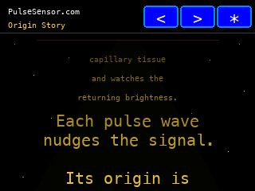</a>

### `app3-origin-crawl-render/app3-origin-crawl-late.png`

<a href="app3-origin-crawl-render/app3-origin-crawl-late.png">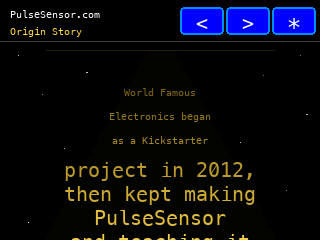</a>

### `app3-origin-crawl-render/app3-origin-crawl-mid.png`

<a href="app3-origin-crawl-render/app3-origin-crawl-mid.png">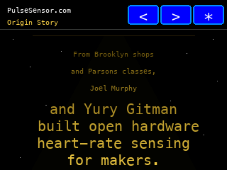</a>

### `app3-origin-crawl-render/app3-origin-crawl-start.png`

<a href="app3-origin-crawl-render/app3-origin-crawl-start.png">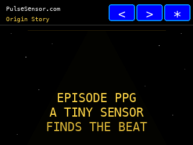</a>

### `app3-origin-crawl-render/app3-origin-crawl-thanks.png`

<a href="app3-origin-crawl-render/app3-origin-crawl-thanks.png">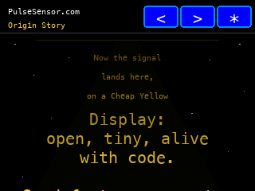</a>

### `app3-origin-crawl-render/app3-origin-title.png`

<a href="app3-origin-crawl-render/app3-origin-title.png">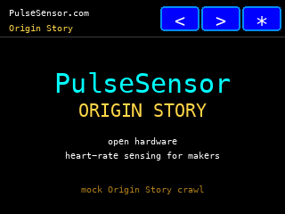</a>

## Root

### `beat-dot-explainer.svg`

## display-mode-render/cycle

### `display-mode-render/cycle/settings-display-color.png`

### `display-mode-render/cycle/settings-display-dark.png`

<a href="display-mode-render/cycle/settings-display-dark.png">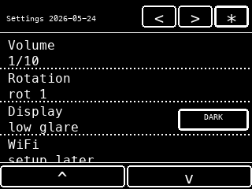</a>

### `display-mode-render/cycle/settings-display-light.png`

### `display-mode-render/cycle/settings-display-mono.png`

<a href="display-mode-render/cycle/settings-display-mono.png">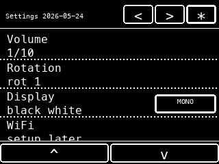</a>

## display-mode-render/review-20260524-display-modes-v2/cycle

### `display-mode-render/review-20260524-display-modes-v2/cycle/settings-display-color_dark.png`

<a href="display-mode-render/review-20260524-display-modes-v2/cycle/settings-display-color_dark.png">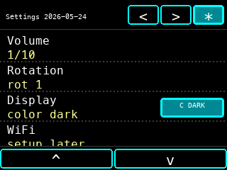</a>

### `display-mode-render/review-20260524-display-modes-v2/cycle/settings-display-color_light.png`

<a href="display-mode-render/review-20260524-display-modes-v2/cycle/settings-display-color_light.png">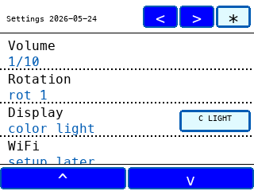</a>

### `display-mode-render/review-20260524-display-modes-v2/cycle/settings-display-mono_dark.png`

<a href="display-mode-render/review-20260524-display-modes-v2/cycle/settings-display-mono_dark.png">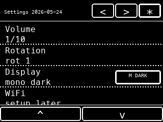</a>

### `display-mode-render/review-20260524-display-modes-v2/cycle/settings-display-mono_light.png`

<a href="display-mode-render/review-20260524-display-modes-v2/cycle/settings-display-mono_light.png">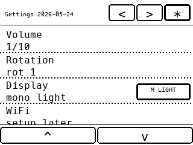</a>

## display-mode-render/review-20260524-display-modes-v2

### `display-mode-render/review-20260524-display-modes-v2/full-panel-all-modes.png`

## display-mode-render/review-20260524-display-modes-v2/screen-preview/color_dark

### `display-mode-render/review-20260524-display-modes-v2/screen-preview/color_dark/pulse-landscape-locked.png`

### `display-mode-render/review-20260524-display-modes-v2/screen-preview/color_dark/pulse-landscape-searching.png`

## display-mode-render/review-20260524-display-modes-v2/screen-preview/color_light

### `display-mode-render/review-20260524-display-modes-v2/screen-preview/color_light/pulse-landscape-locked.png`

### `display-mode-render/review-20260524-display-modes-v2/screen-preview/color_light/pulse-landscape-searching.png`

## display-mode-render/review-20260524-display-modes-v2/screen-preview/mono_dark

### `display-mode-render/review-20260524-display-modes-v2/screen-preview/mono_dark/pulse-landscape-locked.png`

### `display-mode-render/review-20260524-display-modes-v2/screen-preview/mono_dark/pulse-landscape-searching.png`

## display-mode-render/review-20260524-display-modes-v2/screen-preview/mono_light

### `display-mode-render/review-20260524-display-modes-v2/screen-preview/mono_light/pulse-landscape-locked.png`

### `display-mode-render/review-20260524-display-modes-v2/screen-preview/mono_light/pulse-landscape-searching.png`

## display-mode-render/review-20260524-display-modes-v2/separate

### `display-mode-render/review-20260524-display-modes-v2/separate/settings-display-color_dark.png`

### `display-mode-render/review-20260524-display-modes-v2/separate/settings-display-color_light.png`

### `display-mode-render/review-20260524-display-modes-v2/separate/settings-display-mono_dark.png`

### `display-mode-render/review-20260524-display-modes-v2/separate/settings-display-mono_light.png`

## display-mode-render/screen-preview/color

### `display-mode-render/screen-preview/color/pulse-landscape-locked.png`

<a href="display-mode-render/screen-preview/color/pulse-landscape-locked.png">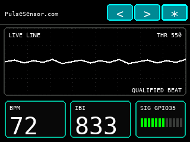</a>

### `display-mode-render/screen-preview/color/pulse-landscape-searching.png`

## display-mode-render/screen-preview/dark

### `display-mode-render/screen-preview/dark/pulse-landscape-locked.png`

### `display-mode-render/screen-preview/dark/pulse-landscape-searching.png`

<a href="display-mode-render/screen-preview/dark/pulse-landscape-searching.png">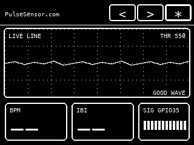</a>

## display-mode-render/screen-preview/light

### `display-mode-render/screen-preview/light/pulse-landscape-locked.png`

<a href="display-mode-render/screen-preview/light/pulse-landscape-locked.png">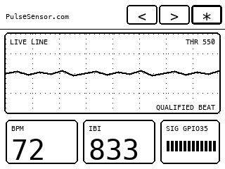</a>

### `display-mode-render/screen-preview/light/pulse-landscape-searching.png`

## display-mode-render/screen-preview/mono

### `display-mode-render/screen-preview/mono/pulse-landscape-locked.png`

<a href="display-mode-render/screen-preview/mono/pulse-landscape-locked.png">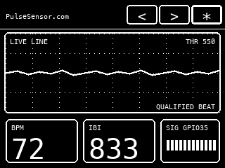</a>

### `display-mode-render/screen-preview/mono/pulse-landscape-searching.png`

## display-mode-render/separate

### `display-mode-render/separate/settings-display-color.png`

<a href="display-mode-render/separate/settings-display-color.png">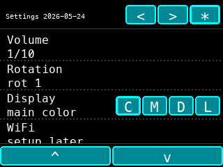</a>

### `display-mode-render/separate/settings-display-dark.png`

<a href="display-mode-render/separate/settings-display-dark.png">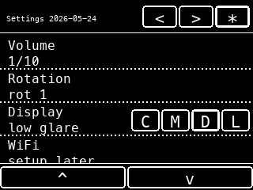</a>

### `display-mode-render/separate/settings-display-light.png`

<a href="display-mode-render/separate/settings-display-light.png">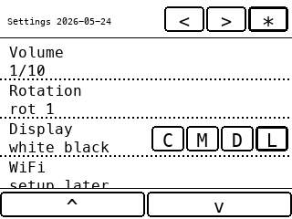</a>

### `display-mode-render/separate/settings-display-mono.png`

<a href="display-mode-render/separate/settings-display-mono.png">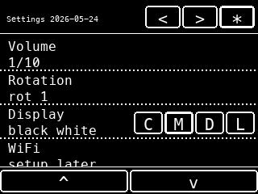</a>

## history/20260522-before-rotation-palette

### `history/20260522-before-rotation-palette/locked.svg`

<a href="history/20260522-before-rotation-palette/locked.svg">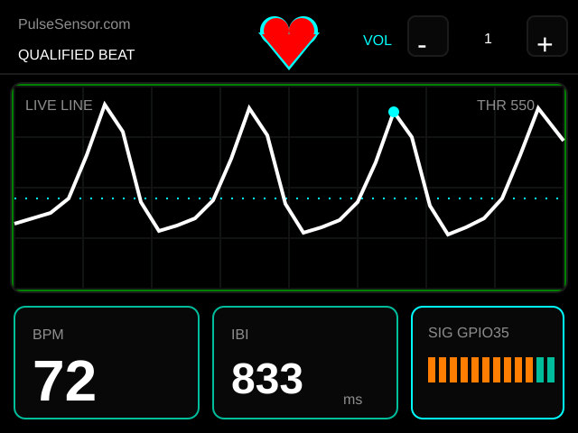</a>

### `history/20260522-before-rotation-palette/searching.svg`

<a href="history/20260522-before-rotation-palette/searching.svg">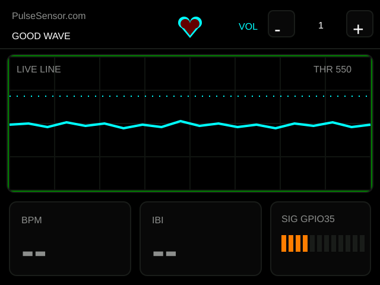</a>

## Root

### `locked.svg`

## monochrome-render

### `monochrome-render/app2-landscape.png`

<a href="monochrome-render/app2-landscape.png">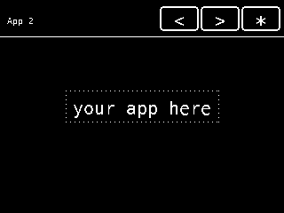</a>

### `monochrome-render/app2-portrait.png`

### `monochrome-render/app3-landscape.png`

<a href="monochrome-render/app3-landscape.png">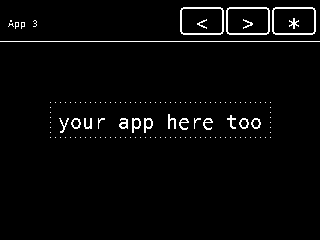</a>

### `monochrome-render/app3-portrait.png`

## monochrome-render/cycle

### `monochrome-render/cycle/settings-landscape-bottom.png`

### `monochrome-render/cycle/settings-landscape-middle.png`

<a href="monochrome-render/cycle/settings-landscape-middle.png">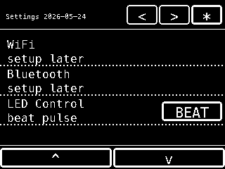</a>

### `monochrome-render/cycle/settings-landscape-top.png`

<a href="monochrome-render/cycle/settings-landscape-top.png">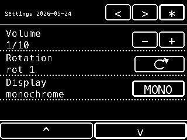</a>

### `monochrome-render/cycle/settings-portrait-bottom.png`

### `monochrome-render/cycle/settings-portrait-middle.png`

<a href="monochrome-render/cycle/settings-portrait-middle.png">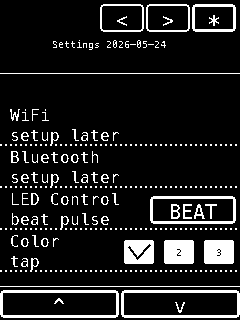</a>

### `monochrome-render/cycle/settings-portrait-top.png`

<a href="monochrome-render/cycle/settings-portrait-top.png">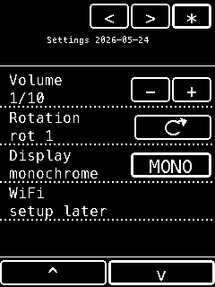</a>

## monochrome-render/inverse

### `monochrome-render/inverse/app2-landscape.png`

<a href="monochrome-render/inverse/app2-landscape.png">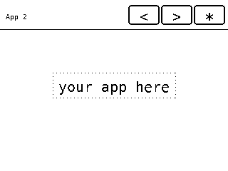</a>

### `monochrome-render/inverse/app2-portrait.png`

### `monochrome-render/inverse/app3-landscape.png`

<a href="monochrome-render/inverse/app3-landscape.png">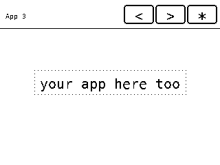</a>

### `monochrome-render/inverse/app3-portrait.png`

<a href="monochrome-render/inverse/app3-portrait.png">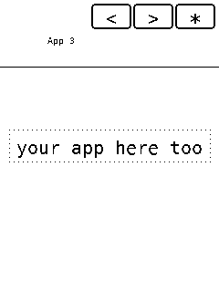</a>

## monochrome-render/inverse/cycle

### `monochrome-render/inverse/cycle/settings-landscape-bottom.png`

### `monochrome-render/inverse/cycle/settings-landscape-middle.png`

### `monochrome-render/inverse/cycle/settings-landscape-top.png`

<a href="monochrome-render/inverse/cycle/settings-landscape-top.png">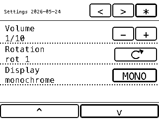</a>

### `monochrome-render/inverse/cycle/settings-portrait-bottom.png`

### `monochrome-render/inverse/cycle/settings-portrait-middle.png`

<a href="monochrome-render/inverse/cycle/settings-portrait-middle.png">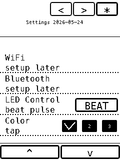</a>

### `monochrome-render/inverse/cycle/settings-portrait-top.png`

<a href="monochrome-render/inverse/cycle/settings-portrait-top.png">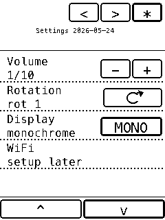</a>

## monochrome-render/inverse

### `monochrome-render/inverse/pulse-landscape-locked.png`

### `monochrome-render/inverse/pulse-landscape-searching.png`

### `monochrome-render/inverse/pulse-portrait-locked.png`

<a href="monochrome-render/inverse/pulse-portrait-locked.png">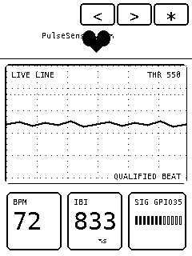</a>

### `monochrome-render/inverse/pulse-portrait-searching.png`

<a href="monochrome-render/inverse/pulse-portrait-searching.png">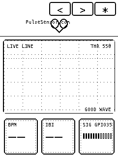</a>

## monochrome-render/inverse/separate

### `monochrome-render/inverse/separate/settings-landscape-bottom.png`

<a href="monochrome-render/inverse/separate/settings-landscape-bottom.png">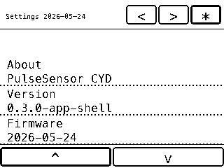</a>

### `monochrome-render/inverse/separate/settings-landscape-middle.png`

<a href="monochrome-render/inverse/separate/settings-landscape-middle.png">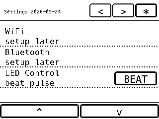</a>

### `monochrome-render/inverse/separate/settings-landscape-top.png`

<a href="monochrome-render/inverse/separate/settings-landscape-top.png">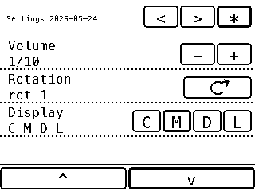</a>

### `monochrome-render/inverse/separate/settings-portrait-bottom.png`

<a href="monochrome-render/inverse/separate/settings-portrait-bottom.png">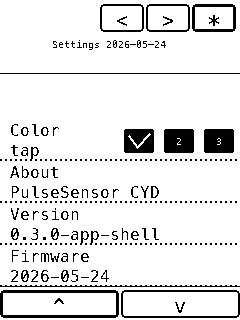</a>

### `monochrome-render/inverse/separate/settings-portrait-middle.png`

### `monochrome-render/inverse/separate/settings-portrait-top.png`

<a href="monochrome-render/inverse/separate/settings-portrait-top.png">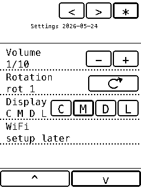</a>

## monochrome-render

### `monochrome-render/pulse-landscape-locked.png`

<a href="monochrome-render/pulse-landscape-locked.png">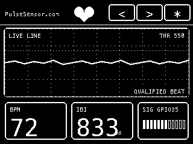</a>

### `monochrome-render/pulse-landscape-searching.png`

<a href="monochrome-render/pulse-landscape-searching.png">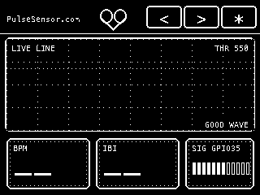</a>

### `monochrome-render/pulse-portrait-locked.png`

<a href="monochrome-render/pulse-portrait-locked.png">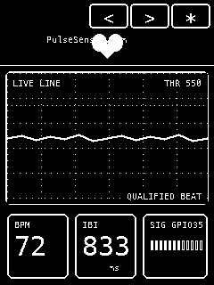</a>

### `monochrome-render/pulse-portrait-searching.png`

<a href="monochrome-render/pulse-portrait-searching.png">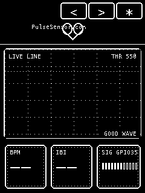</a>

### `monochrome-render/review-20260524-pulse-landscape-locked.png`

### `monochrome-render/review-20260524-pulse-landscape-searching.png`

## monochrome-render/separate

### `monochrome-render/separate/settings-landscape-bottom.png`

<a href="monochrome-render/separate/settings-landscape-bottom.png">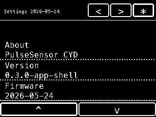</a>

### `monochrome-render/separate/settings-landscape-middle.png`

### `monochrome-render/separate/settings-landscape-top.png`

<a href="monochrome-render/separate/settings-landscape-top.png">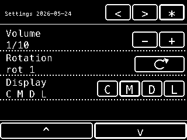</a>

### `monochrome-render/separate/settings-portrait-bottom.png`

<a href="monochrome-render/separate/settings-portrait-bottom.png">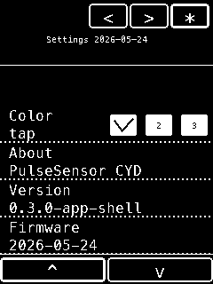</a>

### `monochrome-render/separate/settings-portrait-middle.png`

<a href="monochrome-render/separate/settings-portrait-middle.png">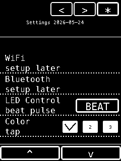</a>

### `monochrome-render/separate/settings-portrait-top.png`

<a href="monochrome-render/separate/settings-portrait-top.png">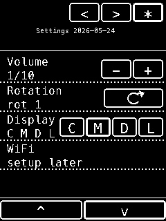</a>

## monochrome-render

### `monochrome-render/settings-landscape-bottom.png`

### `monochrome-render/settings-landscape-middle.png`

### `monochrome-render/settings-landscape-top.png`

### `monochrome-render/settings-portrait-bottom.png`

### `monochrome-render/settings-portrait-middle.png`

### `monochrome-render/settings-portrait-top.png`

## Root

### `portrait-locked.svg`

## pulse-render

### `pulse-render/pulse-landscape-locked.png`

### `pulse-render/pulse-landscape-searching.png`

### `pulse-render/pulse-portrait-locked.png`

### `pulse-render/pulse-portrait-searching.png`

## Root

### `searching.svg`

## settings-render

### `settings-render/settings-landscape-bottom.png`

### `settings-render/settings-landscape-middle.png`

### `settings-render/settings-landscape-top.png`

### `settings-render/settings-portrait-bottom.png`

### `settings-render/settings-portrait-middle.png`

### `settings-render/settings-portrait-top.png`

