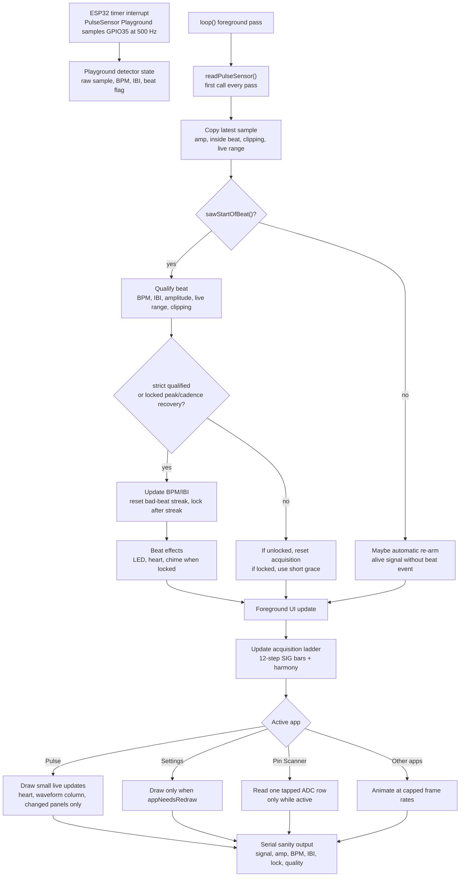

# Signal-First Firmware Architecture

This firmware is a PulseSensor dashboard first, and an app shell second.
The best possible raw signal, BPM, IBI, and qualified-beat behavior outrank
drawings, display modes, app switching, Pin Scanner, sound, and story screens.

This note is for future maintainers who do not know the project history. Keep it
close to the code when changing the firmware.

## First Principles

- `GPIO35` is the primary tested PulseSensor signal input on this CYD.
- `analogReadResolution(10)` is required because PulseSensor Playground expects
  `0..1023` samples and threshold math.
- `readPulseSensor()` must remain the first meaningful call in `loop()`.
- PulseSensor Playground samples ESP32 ADC data from a 500 Hz timer interrupt,
  but foreground drawing can still delay visible trace updates, serial output,
  and beat effects.
- The `SIG GPIO35` bars are a user-facing acquisition ladder, not proof of BPM
  lock. They may rise from raw signal range, amplitude, cleanliness, and detector
  activity before the firmware trusts BPM/IBI.
- Acquire strictly, hold gently: first lock still requires four consecutive
  qualified beats, but an already-locked signal may survive two rejected beat
  events within a 2200 ms window.
- After lock, stable peak cadence can rescue true positives when slight movement
  distorts the valley/trough. This recovery path must stay narrow: plausible
  BPM/IBI, close cadence to the last trusted IBI, a fresh beat event with live
  signal movement, and low clipping.
- After lock, strict beat events also respect the same cadence guard so a short
  movement blip cannot overwrite a stable BPM/IBI run just because it falls
  inside the broad absolute IBI range.
- The live waveform and `SIG GPIO35` panel must share the same state color path:
  yellow while acquiring, then the locked signal color after lock. This keeps
  the visible graph and the acquisition/lock cue from teaching different states.
- Live Pulse dashboard work must be small, change-driven, and non-blocking.
- Full-screen redraws are allowed on intentional screen changes, not as part of
  normal live waveform or beat updates.
- New apps must not pause or gate PulseSensor updates.
- Diagnostic tools are welcome, but they must start idle and stay opt-in.
- Hardware validation notes must record sensor body position and contact method.
  Earlobe, finger, wrist, and loose contact can behave differently and should not
  be compared without naming the condition.

## Program Logic Graph

## Tap-To-Reacquire

If a learner can see a strong pulse wave but the detector is stuck in a long
false-negative run, tapping the Pulse dashboard below the navigation/header is a
manual "look again" action.

The tap-to-reacquire path:

- runs only on the Pulse dashboard;
- lets app navigation handle touches first;
- calls `rearmPulseDetector("manual touch reacquire")`;
- clears local signal window, clipping score, lock quality, BPM, IBI, LED pulse,
  and dashboard draw state;
- redraws the Pulse dashboard once so the learner gets immediate feedback.

This is intentionally not a new mode. It is an escape hatch for the real-world
moment where the visible waveform is good but beat detection has lost trust.

## What Not To Regress

- Do not put touch, drawing, app switching, scanner reads, sound, or story
  animation before `readPulseSensor()`.
- Do not redraw the whole graph frame on every waveform wrap.
- Do not redraw BPM, IBI, and SIG panels as one bundle when only one value
  changed.
- Do not make Pin Scanner continuously scan all pins. It should start idle and
  scan only one tapped ADC-capable candidate.
- Do not use `GPIO22` as the dashboard PulseSensor input. It showed usable raw
  signal in scanning, but a dashboard experiment caused screen on/off reset
  behavior.
- Do not tune beat math to hide a drawing performance problem. Measure first.
- Do not equate acquisition bars with BPM lock. Bars can guide finger placement;
  lock still requires consecutive qualified beats.
- Do not drop an already-locked signal on the first unqualified beat. Use the
  lock-hold grace path so movement blips do not erase a real pulse run.
- Do not update BPM or IBI from grace-held rejected beats. Keep the last trusted
  BPM/IBI until the next strict qualified beat, the locked-only peak/cadence
  recovery path accepts a plausible true positive, or lock drops.
- Do not give the waveform its own acquisition color palette. Use
  `signalSearchColor()` and `signalLockColor()` through `liveTraceColorForMode()`
  so the graph and `SIG GPIO35` panel stay synchronized.
- Do not ship `PERF_DIAGNOSTICS` enabled by default.

## Good Hackable Patterns

- Keep the beginner-friendly single `.ino` shape.
- Keep important constants near the top with names a classroom reader can scan.
- Prefer small helper functions with plain names over clever abstractions.
- Comment decisions that protect signal quality or explain hardware behavior.
- Keep render/mock tools separate from firmware timing-critical code.
- Add guard checks in `tools/check_app_shell.py` when a signal-safety rule is
  important enough to preserve across future UI work.

## Measuring Signal Safety

When signal behavior feels worse:

1. Confirm `readPulseSensor()` is still first in `loop()`.
2. Temporarily set `PERF_DIAGNOSTICS` to `1`.
3. Build, flash, and watch serial for `perf app=...` lines.
4. Compare max read gap and max draw labels while on Pulse, Settings, Pin
   Scanner, and Origin Story.
5. Reduce foreground drawing or app work before changing PulseSensor thresholds
   or qualified-beat math.

The goal is not maximum frames per second. The goal is a responsive raw waveform
and dependable BPM, IBI, and qualified-beat feedback on real CYD hardware.
