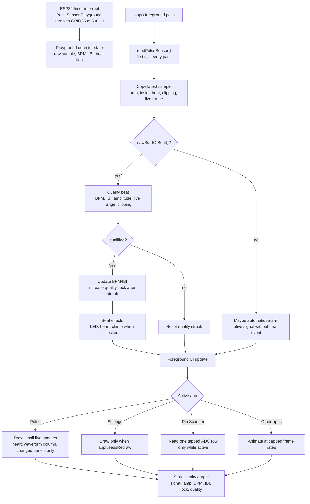

# Signal-First Firmware Architecture

This firmware is a PulseSensor dashboard first, and an app shell second.
The best possible raw signal, BPM, IBI, and qualified-beat behavior outrank
drawings, display modes, app switching, Pin Scanner, sound, and story screens.

This note is for future maintainers who do not know the project history. Keep it
close to the code when changing the firmware.

## First Principles

- `GPIO35` is the primary tested PulseSensor signal input on this CYD.
- `analogReadResolution(10)` is required because PulseSensor Playground expects
  `0..1023` samples and threshold math.
- `readPulseSensor()` must remain the first meaningful call in `loop()`.
- PulseSensor Playground samples ESP32 ADC data from a 500 Hz timer interrupt,
  but foreground drawing can still delay visible trace updates, serial output,
  and beat effects.
- Live Pulse dashboard work must be small, change-driven, and non-blocking.
- Full-screen redraws are allowed on intentional screen changes, not as part of
  normal live waveform or beat updates.
- New apps must not pause or gate PulseSensor updates.
- Diagnostic tools are welcome, but they must start idle and stay opt-in.

## Program Logic Graph

## Tap-To-Reacquire

If a learner can see a strong pulse wave but the detector is stuck in a long
false-negative run, tapping the Pulse dashboard below the navigation/header is a
manual "look again" action.

The tap-to-reacquire path:

- runs only on the Pulse dashboard;
- lets app navigation handle touches first;
- calls `rearmPulseDetector("manual touch reacquire")`;
- clears local signal window, clipping score, lock quality, BPM, IBI, LED pulse,
  and dashboard draw state;
- redraws the Pulse dashboard once so the learner gets immediate feedback.

This is intentionally not a new mode. It is an escape hatch for the real-world
moment where the visible waveform is good but beat detection has lost trust.

## What Not To Regress

- Do not put touch, drawing, app switching, scanner reads, sound, or story
  animation before `readPulseSensor()`.
- Do not redraw the whole graph frame on every waveform wrap.
- Do not redraw BPM, IBI, and SIG panels as one bundle when only one value
  changed.
- Do not make Pin Scanner continuously scan all pins. It should start idle and
  scan only one tapped ADC-capable candidate.
- Do not use `GPIO22` as the dashboard PulseSensor input. It showed usable raw
  signal in scanning, but a dashboard experiment caused screen on/off reset
  behavior.
- Do not tune beat math to hide a drawing performance problem. Measure first.
- Do not ship `PERF_DIAGNOSTICS` enabled by default.

## Good Hackable Patterns

- Keep the beginner-friendly single `.ino` shape.
- Keep important constants near the top with names a classroom reader can scan.
- Prefer small helper functions with plain names over clever abstractions.
- Comment decisions that protect signal quality or explain hardware behavior.
- Keep render/mock tools separate from firmware timing-critical code.
- Add guard checks in `tools/check_app_shell.py` when a signal-safety rule is
  important enough to preserve across future UI work.

## Measuring Signal Safety

When signal behavior feels worse:

1. Confirm `readPulseSensor()` is still first in `loop()`.
2. Temporarily set `PERF_DIAGNOSTICS` to `1`.
3. Build, flash, and watch serial for `perf app=...` lines.
4. Compare max read gap and max draw labels while on Pulse, Settings, Pin
   Scanner, and Origin Story.
5. Reduce foreground drawing or app work before changing PulseSensor thresholds
   or qualified-beat math.

The goal is not maximum frames per second. The goal is a responsive raw waveform
and dependable BPM, IBI, and qualified-beat feedback on real CYD hardware.
